<h1 align="center">
 
  <br />
  Working with peripheral devices in Kali Linux
</h1>

#### In this work I will answer questions and I will do practical tasks for Kali Linux. This work is created for the purpose of educational content, as an assignment for the discipline Operating Systems of the Kyiv College of Communications.

---


## Before we begin, let's consider the following question:

### Required commands for installing interpreters (except `bash`):

A shell or `shell` is a program that provides user interaction with the operating system.
A shell usually supports a command line, environment variables, a history of executed commands, and its own configuration files. The main purpose of a shell is to execute user commands. A shell is also a programming environment.

In addition to `bash`, there are also interpreters: `Zsh` (Z shell) and `Fish` (Friendly Interactive Shell). In order to install them, we can use the following commands:
```
sudo apt install zsh
sudo apt install fish
```

After installing them, we can temporarily switch to these `shells`, for this we will need to use the following commands in the terminal:
```
zsh
# OR
fish
```

And in order to change the default `shell` for the current user, we can use the following commands:
```
chsh -s /usr/bin/zsh
# OR
chsh -s /usr/bin/fish
```

#### Overview of the capabilities of each `Shell`:

| **Shell**   | **Installation Command**                     | **Key Features and Benefits**                                                                                                                                                                                                                                                                                           |
|-------------|----------------------------------------------|-------------------------------------------------------------------------------------------------------------------------------------------------------------------------------------------------------------------------------------------------------------------------------------------------------------------------|
| **Zsh**     | `sudo apt install zsh`                       | Zsh is a powerful and flexible interpreter that supports advanced autocompletion, custom themes, plug-in integration (e.g. via Oh My Zsh), convenient integration with Git, command history between sessions, error autocorrection, and the ability to customize it for yourself.                                       |
| **Fish**    | `sudo apt install fish`                      | Fish is a modern shell with a focus on convenience. It has color syntax highlighting, built-in hints based on command history, automatic command completion, simple syntax for scripts and configurations, and does not require additional configuration after installation — everything works “out of the box”.        |
| **Bash**    | Missing (because it is installed by default) | Bash is the standard shell in most Linux distributions, a versatile tool for automation, scripting, and system management. It supports variables, functions, conditions, loops, I/O operators, and integrates with all Linux utilities. Its compatibility and stability make it indispensable in system administration. |

#### My recommendations for using these `shells`:

🟣 `Zsh` is a great option for developers and power users who want a customized environment for themselves.

🟣 `Fish` is perfect for beginners and those who want a beautiful and intuitive `shell`.

🟣 `Bash` is a standard for many systems, especially for writing scripts, so every professional user needs to know it.

And in order to check which `shell` is installed on our machine, we can use the following command: `cat /etc/shells`, this command will display a list of installed interpreters.

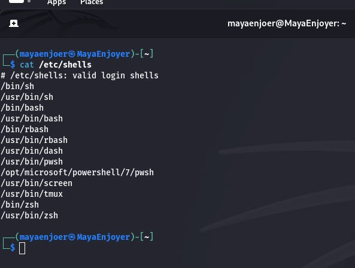


### Next, let's work in the terminal and consolidate the studied material:

<h1 align="center">

    Practical tasks:

</h1>

### Creating 10 new users in the system and distributing them into groups:

The first thing we need to do is create five separate groups according to job roles, we can do this with the following commands:
```
sudo groupadd Technical_support
sudo groupadd Developers
sudo groupadd Financiers
sudo groupadd Founders
sudo groupadd Guests
```
The `groupadd` command creates a new group on the system by adding an entry to the `/etc/group` file, this allows us to centrally manage user access, rights and settings.


After creating user groups, we need to create 10 users with unique names, we can do this with the following commands:
```
sudo useradd -m MayaEnjoyer_number_1
sudo useradd -m MayaEnjoyer_number_2
sudo useradd -m MayaEnjoyer_number_3
sudo useradd -m MayaEnjoyer_number_4
sudo useradd -m MayaEnjoyer_number_5
sudo useradd -m MayaEnjoyer_number_6
sudo useradd -m MayaEnjoyer_number_7
sudo useradd -m MayaEnjoyer_number_8
sudo useradd -m MayaEnjoyer_number_9
sudo useradd -m MayaEnjoyer_number_10
```

In these commands, the `-m` parameter creates a home directory for each user (`/home/username`), and the `useradd` command adds a new account to `/etc/passwd`, as well as creates a corresponding entry in `/etc/shadow`, `/etc/group` and `/etc/gshadow`.

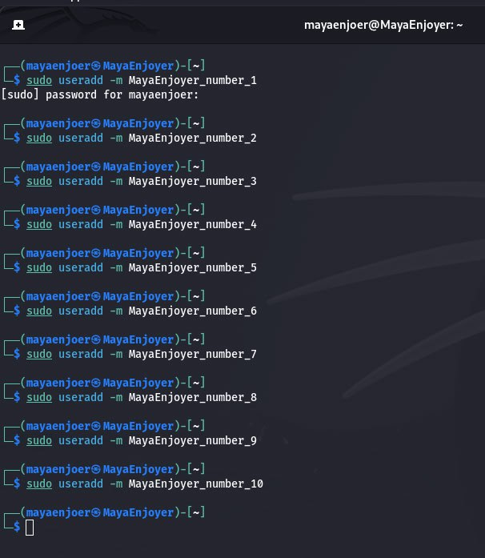

After creating users, we need to assign passwords to users, we can do this using the following commands:
```
sudo passwd MayaEnjoyer_number_1
sudo passwd MayaEnjoyer_number_2
sudo passwd MayaEnjoyer_number_3
sudo passwd MayaEnjoyer_number_4
sudo passwd MayaEnjoyer_number_5
sudo passwd MayaEnjoyer_number_6
sudo passwd MayaEnjoyer_number_7
sudo passwd MayaEnjoyer_number_8
sudo passwd MayaEnjoyer_number_9
sudo passwd MayaEnjoyer_number_10
```

The `passwd` command starts the password assignment procedure, where the system requires you to enter a new password twice for confirmation, after which the entered password will immediately be encrypted and written to the `/etc/shadow` file.

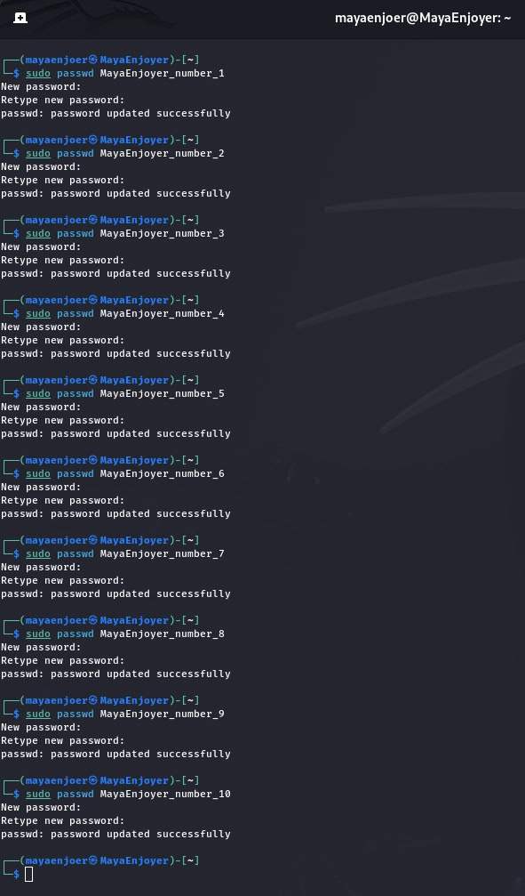

After we have distributed the passwords, we need to distribute the users into groups, we will do this using the following commands:
```
sudo usermod -aG Technical_support MayaEnjoyer_number_1
sudo usermod -aG Technical_support MayaEnjoyer_number_2
sudo usermod -aG Developers MayaEnjoyer_number_3
sudo usermod -aG Developers MayaEnjoyer_number_4
sudo usermod -aG Financiers MayaEnjoyer_number_5
sudo usermod -aG Financiers MayaEnjoyer_number_6
sudo usermod -aG Founders MayaEnjoyer_number_7
sudo usermod -aG Founders MayaEnjoyer_number_8
sudo usermod -aG Guests MayaEnjoyer_number_9
sudo usermod -aG Guests MayaEnjoyer_number_10
```
In short, the `usermod -aG` command adds the user to an additional group (in the parameter `-aG`):

🟣 `-a` means "append".

🟣 `-G` specifies the groups to which the user is added.

And if `-a` is not used, the user will be excluded from all other groups.

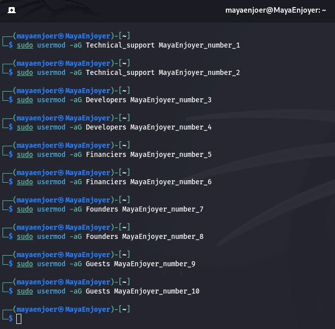

After that, we can check the membership in the groups, we can do this using the following command: `getent group Technical_support && getent group Developers && getent group Financiers && getent group Founders && getent group Guests`. It is the `getent group` command that displays information about the group: its name, GID (identifier), and the names of the users who are members of this group.

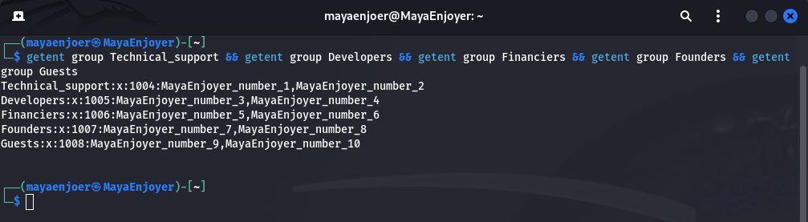

### Defining the default shell for each user:

To install `bash` for Technical Support, we will use the following commands:
```
sudo usermod -s /bin/bash MayaEnjoyer_number_1
sudo usermod -s /bin/bash MayaEnjoyer_number_2
```

These commands install the default Bash shell for support users.

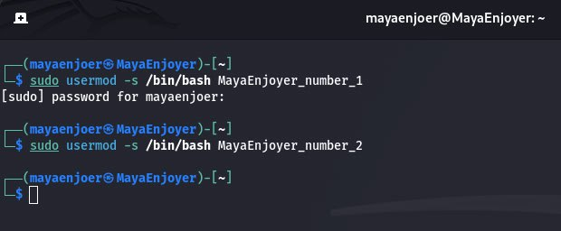

To install `zsh` for Developers we will use the following commands:
```
sudo usermod -s /usr/bin/zsh MayaEnjoyer_number_3
sudo usermod -s /usr/bin/zsh MayaEnjoyer_number_4
```

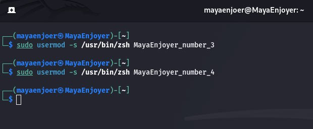

And to deny access to the `Financiers` shell, we will use the following commands:
```
sudo usermod -s /usr/sbin/nologin MayaEnjoyer_number_5
sudo usermod -s /usr/sbin/nologin MayaEnjoyer_number_6
```
`nologin` is a special pseudo-shell that denies logging in. This is quite useful for accounts that do not need to have access to the terminal.

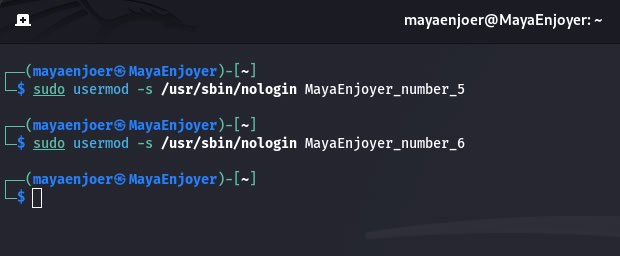

To install `fish` for Founders we will use the following commands:
```
sudo usermod -s /usr/bin/fish MayaEnjoyer_number_7
sudo usermod -s /usr/bin/fish MayaEnjoyer_number_8
```

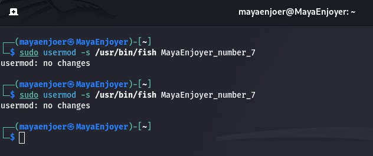

But in order to deny access to the Guests shell, we will use the following commands:
```
sudo usermod -s /usr/sbin/nologin MayaEnjoyer_number_9
sudo usermod -s /usr/sbin/nologin MayaEnjoyer_number_10
```

That is, these users will be prohibited from using the terminal, this action is usually applied to guest accounts or service accounts.

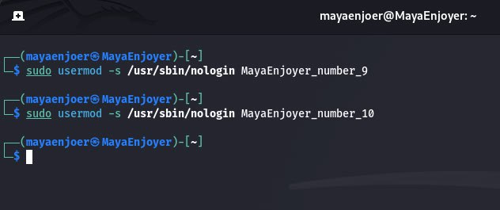

And to verify our results, we will use the following command: `getent passwd MayaEnjoyer_number_1 MayaEnjoyer_number_2 MayaEnjoyer_number_3 MayaEnjoyer_number_4 MayaEnjoyer_number_5 MayaEnjoyer_number_6 MayaEnjoyer_number_7 MayaEnjoyer_number_8 MayaEnjoyer_number_9 MayaEnjoyer_number_10`. This command will print information from `/etc/passwd`, where the last field is the path to the installed `shell`.

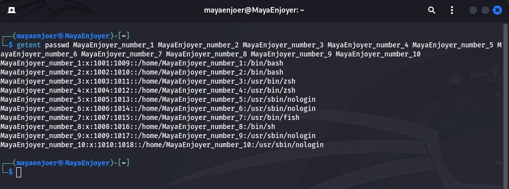

### Demonstration of the work of each user group in its command interpreter:

In order to check the operation of Technical Support (`bash`), we must first log in as a user, this can be done using the command: `su - MayaEnjoyer_number_1`. After that, we can use the following commands to check:
```
# View kernel version
uname -r
# OS information
cat /etc/os-release
# View memory information
free -h
# Free disk space
df -h
# Current directory
pwd
```

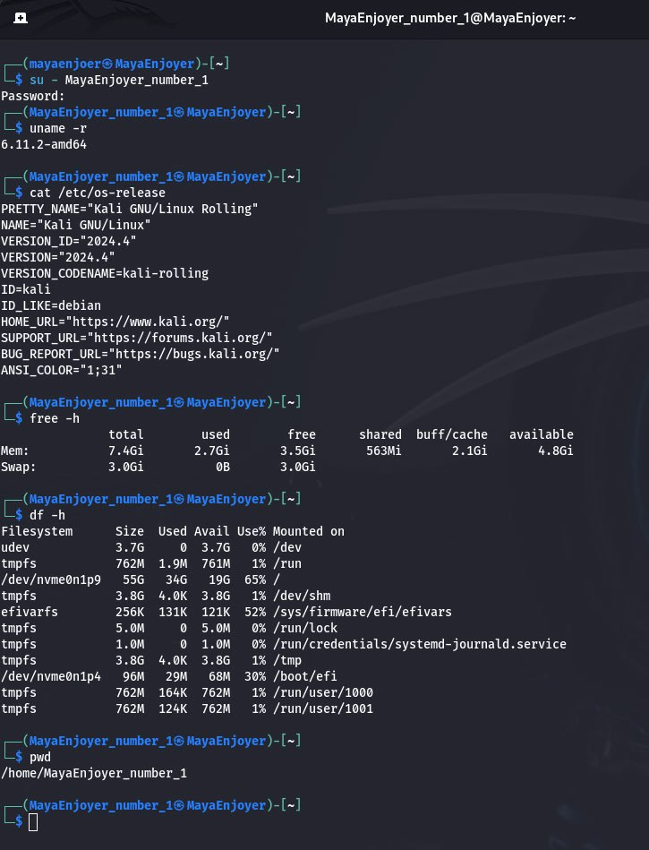

And in order to check the work of Developers (`zsh`), we must first log in as a user, this can be done using the command: `su - MayaEnjoyer_number_3`. After that, we can use the following commands to check:
```
# Current user name
whoami
# System architecture
uname -m
# Python version
python3 --version
# Home directory structure
ls -alh ~
# Current date
date
```

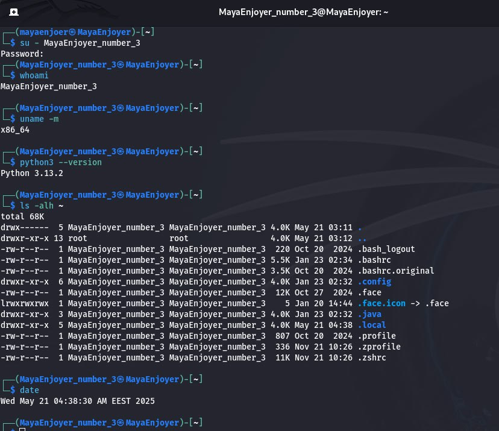

We cannot test the operation of Financiers (`nologin`) because users with the `/usr/sbin/nologin` shell are not allowed to log in to the system via the terminal. This is to protect against unwanted access to the command line, and when we try to log in using the following command: `su - MayaEnjoyer_number_5`, we get an error.

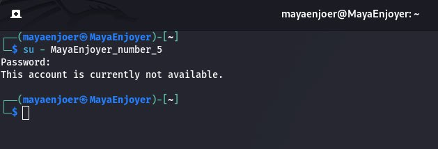

And in order to check the work of Founders (`fish`), we must first log in as a user, this can be done using the command: `su - MayaEnjoyer_number_7`. After that, we can use the following commands to check:

```
# Hostname
hostname
# View CPU information
cat /proc/cpuinfo | grep "model name" | head -1
# Current date
date
# Current directory
pwd
# File listing
ls -lh
```

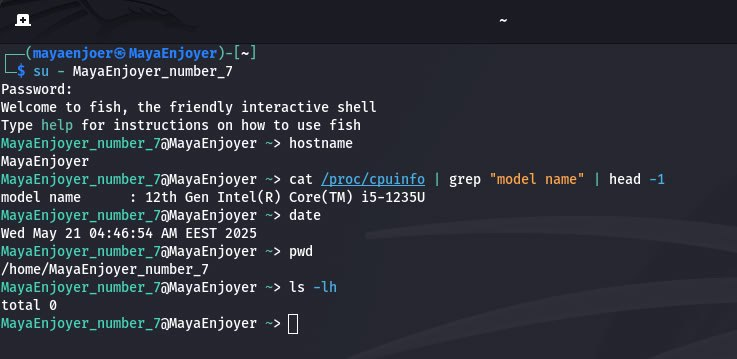

But to test the operation of Guests (`nologin`), we can do nothing, because like the Financiers group, these users are not able to start the interpreter, because they have a restriction set for system protection. And when trying to log in, a message will be displayed that the session is unavailable.

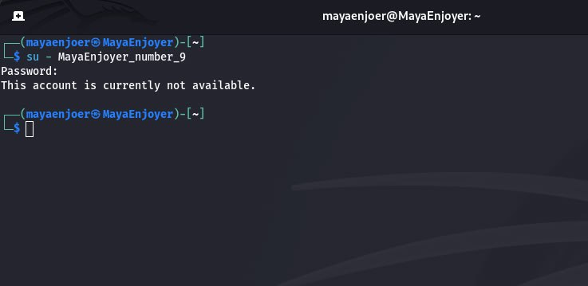

#### Conclusion: While working in Kali Linux, I gained practical skills in managing users and groups in a multi-user environment. I created 10 users named `MayaEnjoyer_number_X`, distributed them into groups (`Technical_support, Developers, Financiers, Founders, Guests`), assigned them appropriate shells or blocked access to the terminal. I also learned to work with key commands: `useradd`, `groupadd`, `usermod`, `passwd`, `getent`, `grep`.

AND AS ALWAYS MY TRADITION, I WISH EVERYONE TO BE HEALTHY AND ALWAYS IN A GOOD MOOD! SO I WISH YOU SUCCESS IN LEARNING KALI LINUX. I LOVE YOU ALL AND SEE YOU SOON ;)


